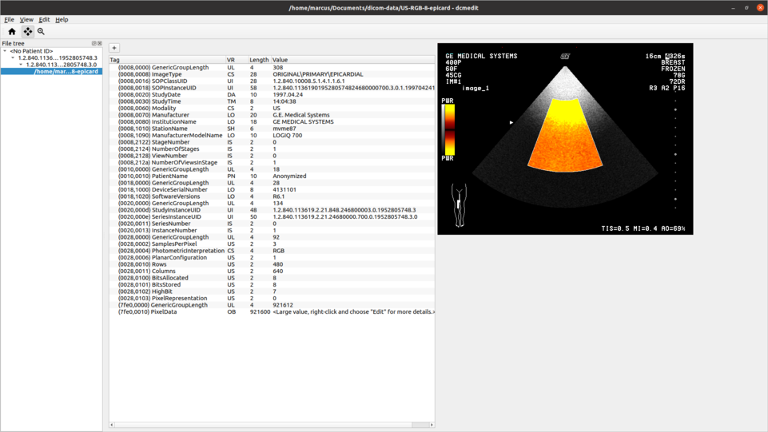

# dcmedit

dcmedit is a DICOM editor for Windows, Linux and macOS, written in C++ using Qt and DCMTK.

## Features

- Add, edit and delete data elements. In single and multiple files.
- See changes to the image immediately.

## How to get it

Downloads for Windows, Linux and macOS can be found [here](https://github.com/Swassie/dcmedit/releases).

## Build it

1. Install Qt, vcpkg and CMake.
1. `cmake -B <build path> -DCMAKE_TOOLCHAIN_FILE=<path to vcpkg>/scripts/buildsystems/vcpkg.cmake <path to dcmedit>`
1. `cmake --build <build path>`
